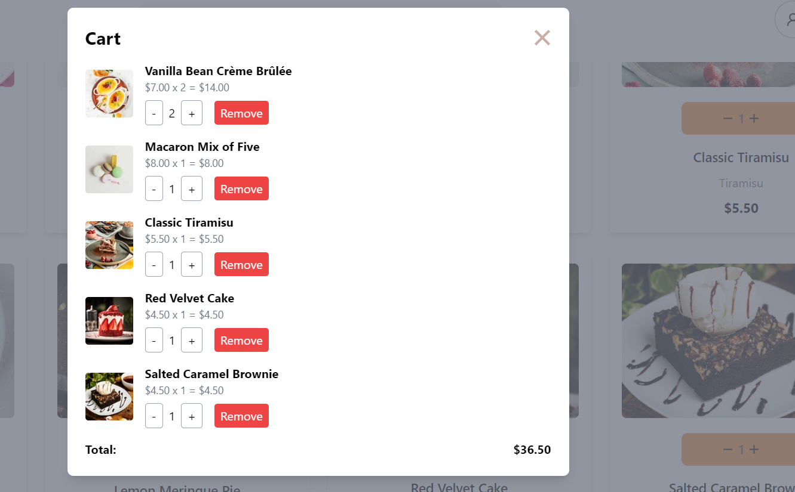

# Frontend Mentor - Product list with cart solution

This is a solution to the [Product list with cart challenge on Frontend Mentor](https://www.frontendmentor.io/challenges/product-list-with-cart-5MmqLVAp_d). Frontend Mentor challenges help you improve your coding skills by building realistic projects.

## Table of contents

- [Overview](#overview)
  - [The challenge](#the-challenge)
  - [Screenshot](#screenshot)
  - [Links](#links)
- [My process](#my-process)
  - [Built with](#built-with)
  - [What I learned](#what-i-learned)
  - [Continued development](#continued-development)
  - [Useful resources](#useful-resources)
- [Author](#author)
- [Acknowledgments](#acknowledgments)

**Note: Delete this note and update the table of contents based on what sections you keep.**

## Overview

### The challenge

Users should be able to:

- Add items to the cart and remove them
- Increase/decrease the number of items in the cart
- See an order confirmation modal when they click "Confirm Order"
- Reset their selections when they click "Start New Order"
- View the optimal layout for the interface depending on their device's screen size
- See hover and focus states for all interactive elements on the page

### Screenshot


Add a screenshot of your solution. The easiest way to do this is to use Firefox to view your project, right-click the page and select "Take a Screenshot". You can choose either a full-height screenshot or a cropped one based on how long the page is. If it's very long, it might be best to crop it.




Alternatively, you can use a tool like [FireShot](https://getfireshot.com/) to take the screenshot. FireShot has a free option, so you don't need to purchase it.

Then crop/optimize/edit your image however you like, add it to your project, and update the file path in the image above.

**Note: Delete this note and the paragraphs above when you add your screenshot. If you prefer not to add a screenshot, feel free to remove this entire section.**

### Links

- Solution URL: [Add solution URL here](https://your-solution-url.com)
- Live Site URL: [Add live site URL here](https://your-live-site-url.com)

## My process

### Built with

- Semantic HTML5 markup
- CSS custom properties
- Flexbox
- CSS Grid
- Tailwind CSS
- Mobile-first workflow
- [React](https://reactjs.org/) - JS library
- [Next.js](https://nextjs.org/) - React framework
- [Styled Components](https://styled-components.com/) - For styles

**Note: These are just examples. Delete this note and replace the list above with your own choices**

### What I learned

I learned a lot of this in this project. managing file links to each other, response websites will all display compatibility. The hard thing in this project is the style given to each element and the functionality of some components, like the login cart, adding items to the cart, and more.

```html
<h1>Some HTML code I'm proud of</h1>
```

```css
.proud-of-this-css {
  color: papayawhip;
}
```

```js
const proudOfThisFunc = () => {
  console.log("🎉");
};
```

If you want more help with writing markdown, we'd recommend checking out [The Markdown Guide](https://github.com/Rahulkrpd) to learn more.

### Continued development

After having confidence in frontend web development, I will go through the backend, but I also know how to implement a backend. This project taught me a lot of things, and some errors helped me understand and brush up my knowledge. And my future learning should be a web site frame work

### Useful resources

I used my self-deployed project for some color, user interaction, and folder structure.

- [Example resource 1](https://food-del-frontend-azwe.onrender.com)

## Author

- Website - [Rahul](https://www.your-site.com)
- Frontend Mentor - [Rahul](https://www.frontendmentor.io/profile/Rahulkrpd)
- Twitter - [@Rahul](https://x.com/Rahul78855734)


## Acknowledgments
I would like to acknowledge the successful completion of the "Dessert Delight" project, created in just 2 days using React and Tailwind CSS. This project stands as a testament to my skills and efficiency in web development. I appreciate the resources and tools that facilitated this rapid development and am proud of the outcome. Thanks to the React and Tailwind communities for their support and inspiration, which contributed significantly to this achievement. This project has been a rewarding challenge and a valuable addition to my portfolio.